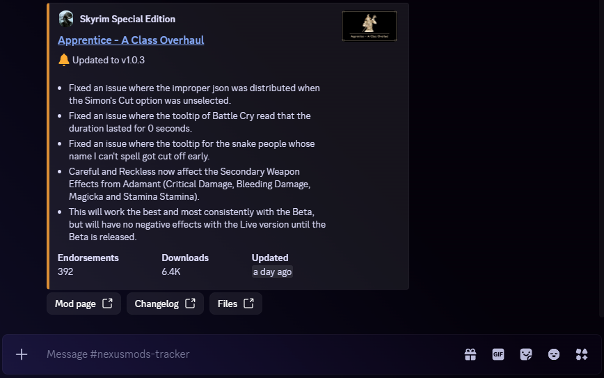

<p align="center">
  
</p>

<p align="center">
  <a href="https://github.com/sohaibirfann/nexusmods-tracker/actions/workflows/ci.yml"></a>
  
  
</p>

A Discord bot that follows your favorite mods on [Nexus Mods](https://www.nexusmods.com) and announces new versions in your server — with the changelog, the version jump, and how the downloads and endorsements moved since last time. No more manually refreshing mod pages to find out something updated.

It's a self-hosted stack: a thin **discord.py** bot talking to a **FastAPI** backend that owns the database and all the Nexus logic.

## Features

- **Track by name or URL** — search a mod with game-scoped autocomplete, or paste its Nexus URL.
- **Rich update posts** — when a tracked mod updates, the announcement shows the version diff (`v5.2 → v5.3`), the changelog, and the change in endorsements/downloads since the last version.
- **Per-server setup** — every server picks its own notification channel, its own tracked list, and an optional role to ping.
- **Efficient polling** — one Nexus request per game per check (via the bulk `updated.json` feed), not one per mod. Full details are only fetched for mods that actually changed.
- **Shared mod rows** — a mod tracked in ten servers is stored (and asked about) once.
- **Nice in-client UX** — ephemeral replies, paginated `/list` with a mod picker, an Undo on `/untrack`, and buttons on cards.

## Commands

| Command | What it does |
| --- | --- |
| `/track <game> <mod>` | Track a mod — pick the game, then search the mod by name |
| `/trackurl <url>` | Track a mod by pasting its Nexus URL |
| `/untrack <mod>` | Stop tracking a mod (with an Undo button) |
| `/list` | List tracked mods, newest-updated first, with a "view a mod" picker |
| `/info <game> <mod>` | Preview a mod's card without tracking it |
| `/setchannel [channel]` | Set the channel where updates get posted *(Manage Server)* |
| `/setping [role]` | Set a role to ping on updates; no role turns pings off *(Manage Server)* |
| `/status` | Show this server's channel, ping role, tracked count, and check interval |
| `/check` | Force an update check right now |
| `/help` | Show every command |

## Screenshots

<p align="center">
  
</p>

<p align="center"><sub>An update announcement — changelog, stats, and quick links to the mod page, changelog, and files.</sub></p>

## How it works

```
┌──────────────────┐   HTTP + X-API-Key   ┌──────────────────────┐
│  Discord Bot     │ ───────────────────► │  FastAPI Backend     │
│  (discord.py)    │ ◄─────────────────── │  guild-aware REST    │
│  slash commands  │                      │  + poll logic        │
│  + APScheduler   │                      └──────┬───────┬───────┘
└──────────────────┘                      ┌──────▼──┐ ┌──▼─────────────┐
                                          │Postgres │ │ Nexus Mods API │
                                          └─────────┘ │ (v1 + GraphQL) │
                                                      └────────────────┘
```

The bot never touches the database directly — it only speaks to the backend over HTTP, authenticated with a shared `X-API-Key`. On a schedule (`POLL_INTERVAL_MINUTES`), the bot calls the backend's `/check`, which asks Nexus for each game's recently-updated mods, compares them against what's stored, and returns the mods that changed along with which channels to notify. In Docker Compose the backend port is never published to the host — only the bot can reach it on the internal network.

## Tech stack

- **Bot** — discord.py 2.7 (app commands, autocomplete, views), APScheduler
- **Backend** — FastAPI, SQLAlchemy 2.0 (async), Alembic, Pydantic Settings, httpx
- **Data** — PostgreSQL (SQLite in tests)
- **Nexus** — v1 REST for mod details / `updated.json` / changelogs, v2 GraphQL for name search
- **Tooling** — Docker Compose, Ruff, pytest, GitHub Actions

## Getting started

### Prerequisites

- [Docker Desktop](https://www.docker.com/products/docker-desktop/) (or Docker Engine + Compose)
- A **Nexus Mods API key** — [account settings → API keys](https://www.nexusmods.com/users/myaccount?tab=api)
- A **Discord bot** — create an application in the [Developer Portal](https://discord.com/developers/applications), add a Bot, and copy its token

### 1. Clone and configure

```bash
git clone https://github.com/sohaibirfann/nexusmods-tracker.git
cd nexusmods-tracker
cp .env.example .env
```

Fill in the three secrets in `.env`:

| Variable | Required | Description |
| --- | --- | --- |
| `NEXUS_API_KEY` | ✅ | Your Nexus Mods API key |
| `DISCORD_BOT_TOKEN` | ✅ | Your Discord bot token |
| `INTERNAL_API_KEY` | ✅ | Shared secret for bot → backend auth |
| `POLL_INTERVAL_MINUTES` | | How often to check Nexus (default `60`) |
| `DATABASE_URL` / `BACKEND_URL` | | Preset for Compose — leave as-is |

Generate a strong internal key with:

```bash
python -c "import secrets; print(secrets.token_urlsafe(32))"
```

### 2. Start the stack

```bash
docker compose up -d --build
```

Compose brings up Postgres, runs the Alembic migrations, starts the backend, then the bot. Watch it come online with:

```bash
docker compose logs -f bot
```

### 3. Invite and use

Invite the bot with the `bot` and `applications.commands` scopes and the **Send Messages** permission. Then, in your server:

```
/setchannel   # where updates get posted
/track        # follow your first mod
```

> [!NOTE]
> The bot uses only slash commands, so no privileged gateway intents are required.

## Hosting

A Discord gateway bot needs a process that never sleeps, so this runs best **self-hosted** — on a home PC or any small VPS. With `restart: unless-stopped` on every service (and Docker set to start on login), the bot is online whenever the machine is. Moving to a VPS later is copy the repo, copy `.env`, `docker compose up -d` — no code changes.

## Development

Run the test suite and linter locally without Docker (tests use SQLite and mock Nexus, so no network or database is needed):

```bash
pip install -r requirements-dev.txt
ruff check .
pytest -q
```

Database schema changes go through Alembic:

```bash
docker compose exec backend alembic revision -m "describe change"   # then edit the migration
docker compose exec backend alembic upgrade head
```

## Project structure

```
backend/     FastAPI app, SQLAlchemy models, Nexus client, /check logic
bot/         discord.py client, slash commands, embed builders, scheduler
alembic/     database migrations
tests/       pytest suite (SQLite + mocked Nexus)
docker-compose.yml
```
